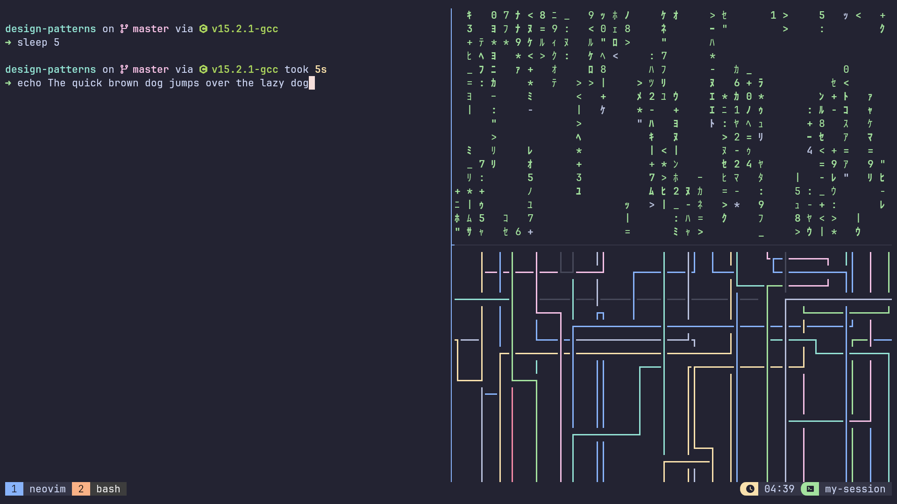
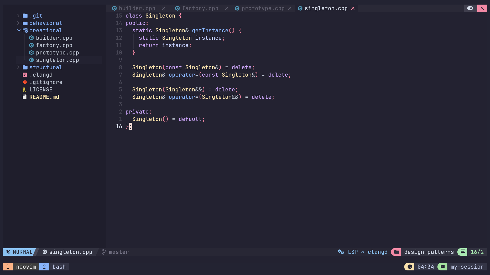
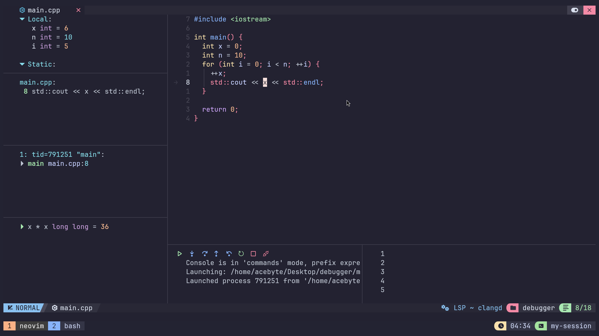

# dotfiles

Personal configuration files for:
- kitty
- starship
- tmux
- Neovim

These are mostly tweaks of [NvChad](https://nvchad.com/) and [DreamsOfCode's tmux setup](https://github.com/dreamsofcode-io/catppuccin-tmux).

# Previews





# Requirements

This setup assumes you already have kitty, starship, tmux, and Neovim installed on your system.

Additional dependencies:
- GNU stow
- [JetBrains Mono Nerd Font](https://github.com/ryanoasis/nerd-fonts/releases/download/v3.4.0/JetBrainsMono.zip)
- [tpm (Tmux Plugin Manager)](https://github.com/tmux-plugins/tpm)

# Installation

Clone the repository to your machine (preferably in `~/.dotfiles`):
```sh
git clone https://github.com/TheAcebyte/dotfiles.git ~/.dotfiles
cd ~/.dotfiles
```

Then, you can install all configurations at once:
```sh
stow -t ~ */
```

Alternatively, you can specify individual packages to install:
```sh
stow -t ~ <kitty/starship/tmux/nvim>
```

> [!NOTE]
> After installation, open tmux and press `<prefix> + I` to install the required plugins.

> [!WARNING]
> Do not delete the repository after installation. The `stow` command creates symbolic links to files in this directory, so removing it will break your configurations.

# Configuration

| Component | Configuration File |
|-----------|-------------------|
| Treesitter | [`nvim/.config/nvim/lua/configs/treesitter.lua`](nvim/.config/nvim/lua/configs/treesitter.lua) |
| LSP Servers | [`nvim/.config/nvim/lua/configs/lspconfig.lua`](nvim/.config/nvim/lua/configs/lspconfig.lua) |
| Formatters | [`nvim/.config/nvim/lua/configs/conform.lua`](nvim/.config/nvim/lua/configs/conform.lua) |
| DAP Adapters | [`nvim/.config/nvim/lua/configs/dap.lua`](nvim/.config/nvim/lua/configs/dap.lua) |

> [!NOTE]
> Don't forget to run `:MasonInstallAll` after restarting Neovim to apply the changes.
