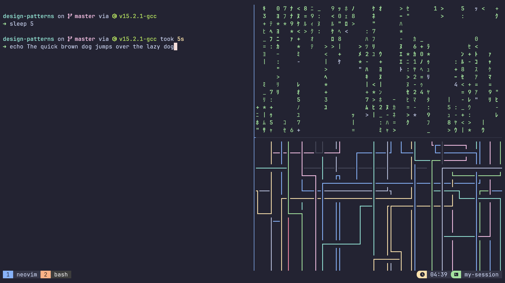
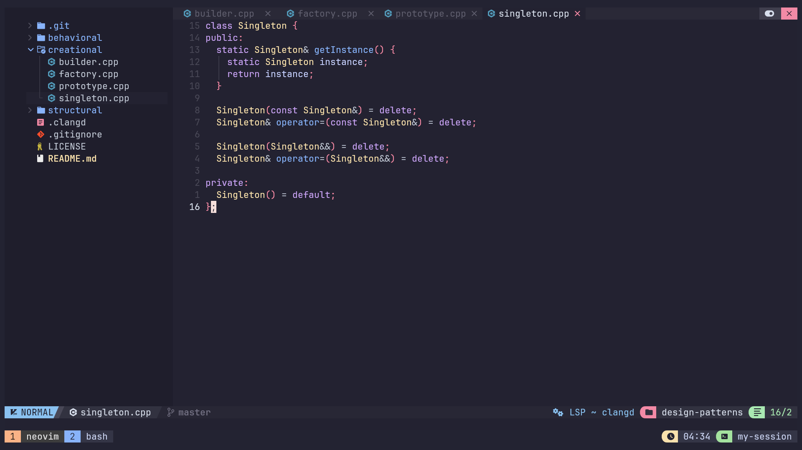
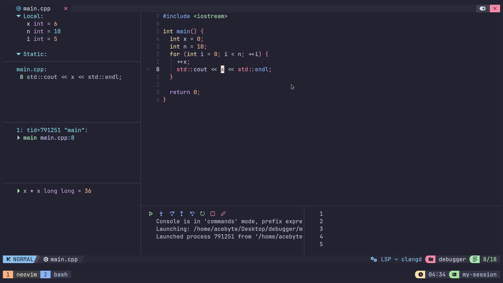

# dotfiles

Personal configuration files for:
- kitty
- starship
- tmux
- Neovim

These are mostly tweaks of [NvChad](https://nvchad.com/) and [DreamsOfCode's tmux setup](https://github.com/dreamsofcode-io/catppuccin-tmux).

# Previews




> PS: I MESSED UP THE PANGRAM

# Requirements

Make sure you have kitty, starship, tmux, and Neovim installed before proceeding.

The table below lists some additional dependencies:

| Dependency | Note |
|------------|------|
| GNU stow | *symlink manager for the dotfiles* |
| [JetBrains Mono Nerd Font](https://github.com/ryanoasis/nerd-fonts/releases/download/v3.4.0/JetBrainsMono.zip) | *font used in the dotfiles* |
| [tpm](https://github.com/tmux-plugins/tpm) | *tmux plugin manager* |
| [tree-sitter-cli](https://github.com/tree-sitter/tree-sitter/blob/master/crates/cli/README.md) | *required for Treesitter* |
| [ripgrep](https://github.com/BurntSushi/ripgrep) | *required for Telescope live grep* |
| [latexmk](https://mgeier.github.io/latexmk.html) | *compiler backend for VimTeX* |
| [zathura](https://github.com/pwmt/zathura) | *PDF viewer for VimTeX* |

# Installation

Clone the repository to your machine (preferably in `~/.dotfiles`):
```sh
git clone https://github.com/TheAcebyte/dotfiles.git ~/.dotfiles
cd ~/.dotfiles
```

Then, you can install all configurations at once:
```sh
stow -t ~ */
```

Alternatively, you can specify individual packages to install:
```sh
stow -t ~ <kitty/starship/tmux/nvim>
```

> [!NOTE]
> After opening tmux, press `<prefix> + I` to install the plugins.
> 
> After opening Neovim, run `:MasonInstallAll` to install the LSP servers, formatters, and DAP adapters. You can add your own according to the [Configuration](#configuration) section below.

> [!WARNING]
> Back up your existing configurations before proceeding, as `stow` will refuse to overwrite existing files.
> 
> Do not delete the repository after installation. The `stow` command creates symbolic links to files in this directory, so removing it will break your configurations.

# Configuration

| Component | Configuration File |
|-----------|-------------------|
| Treesitter | [`nvim/.config/nvim/lua/configs/treesitter.lua`](nvim/.config/nvim/lua/configs/treesitter.lua) |
| LSP Servers | [`nvim/.config/nvim/lua/configs/lspconfig.lua`](nvim/.config/nvim/lua/configs/lspconfig.lua) |
| Formatters | [`nvim/.config/nvim/lua/configs/conform.lua`](nvim/.config/nvim/lua/configs/conform.lua) |
| DAP Adapters | [`nvim/.config/nvim/lua/configs/dap.lua`](nvim/.config/nvim/lua/configs/dap.lua) |

> [!NOTE]
> Don't forget to run `:MasonInstallAll` after restarting Neovim to install the newly configured tools.
